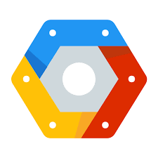
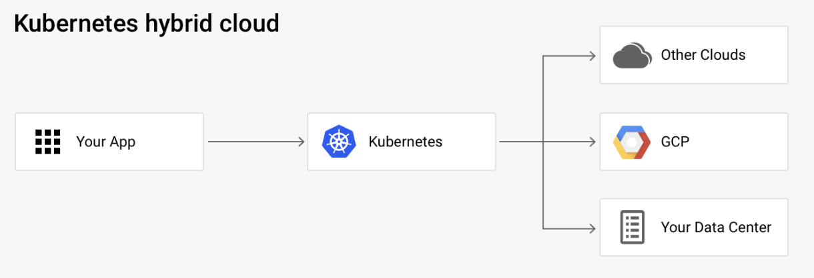

 

# 
 Google Cloud Compute Services 

____

## Introduction

The very first cloud computing services goes back to about 2002 when Amazon released the AWS platform and exposed the technology to the rest of the world. It enabled technololgy experts to develop innovative applications and changed the way they are built. AWS had an early lead in the cloud computing and has continued to dominate the industry. The Elastic Cloud Compute Engine, a cloud-based virtual machine was one of their first innovations. Over the years, other competitors such as Microsoft, IBM, and Google came with their versions of the compute services that not only compete with Amazon, but continue to change the way developers build applications. With enterprise service-level agreements (SLA), Google launched their first compute engine service in 2013 and availed it to the general public. The Google Cloud Platform currently provides a myriad of services that span from storage,big data tools,networking et cetera. This tutorial will mainly focus on its compute stack, when to chose which service and how to get up and running with each. 
d
## The Core Google Compute Offerrings
This section summarizes the different compute offering in the google cloud infrastructure. 

 ### Google Compute Engine (GCE)
  
The google cloud compute is an infrastucture as a service offering that provides the power of creating virtual machines and the ability to alocate attributes such as memory, CPU, type of storage, and size of storage as well. It can be compared to building a whole computer with the ability to customizing the features according to your requirements and workloads.

### Google Kubernetes Engine (GKE)

Kubernetes is a container as a service that is basically an abstraction of the compute engine. It enables customers to run fully managed Docker containers. A container is a service that helps modularize applications. Why containers? Contrary to virtualization with regard to irtual machines, containers virtualize at the level of teh operating system and run the on the operating system directly. They are quite light weight, start fater than conventional VMs and use very small portion of the memory of the operating system. They also allow faster development and reliability. Kubernetes helps with the automation, monitoring, management and the deployment of these containers. 

### Google App Engine (GAE)
  
Google App Engine is googles dedicated platform as a service(Paas), and is pretty much based on a "bring your code and we'll take care of the rest kind of model. This provides customers with ability to focus on development and not the infrastucture behind the development platform. The customers do have have to deal with underlying requirements of the hardware. In other words, the plaftform is ready to go. It automatically handles scaling to ensure the demands of the customer are met. The app engine can use kubernetes in the background for this cases but the user does not handly what goes on with it. It is therefore ideal for developers that does not need to deal with the idea of server configurations such as load balancing. It it mostly used for web applications.

