<h1>  
GOOGLE CLOUD COMPUTE SERVICES 
</h1>
Getting Started with Google Cloud Compute

## 1. Introduction

The very first cloud computing services goes back to about 2002 when Amazon released the AWS platform and exposed the technology to the rest of the world. It enabled technololgy experts to develop innovative applications and changed the way they are built. AWS had an early lead in the cloud computing and has continued to dominate the industry. The Elastic Cloud Compute Engine, a cloud-based virtual machine was one of their first innovations. Over the years, other competitors such as Microsoft, IBM, and Google came with their versions of the compute services that not only compete with Amazon, but continue to change the way developers build applications. With enterprise service-level agreements (SLA), Google launched their first compute engine service in 2013 and availed it to the general public. The Google Cloud Platform currently provides a myriad of services that span from storage,big data tools,networking et cetera. This tutorial will mainly focus on its compute stack, when to chose which service and how to get up and running with each. 

## 2. The Core Google Compute Offerrings</h2>

Google compute comes in three different offerings. These are the Google Compute Engine, Google Kubernetes Engine, and the Google App Engine. The choice of compute service depends on things such as customer demands, the application requirements as well skills when it comes to infrastucture. The image below provides the major difference between the three. This section summarizes these different compute offerings in the google cloud infrastructure.  Then we will explore how to get up and running with each service and also deploy a simple application. 

 

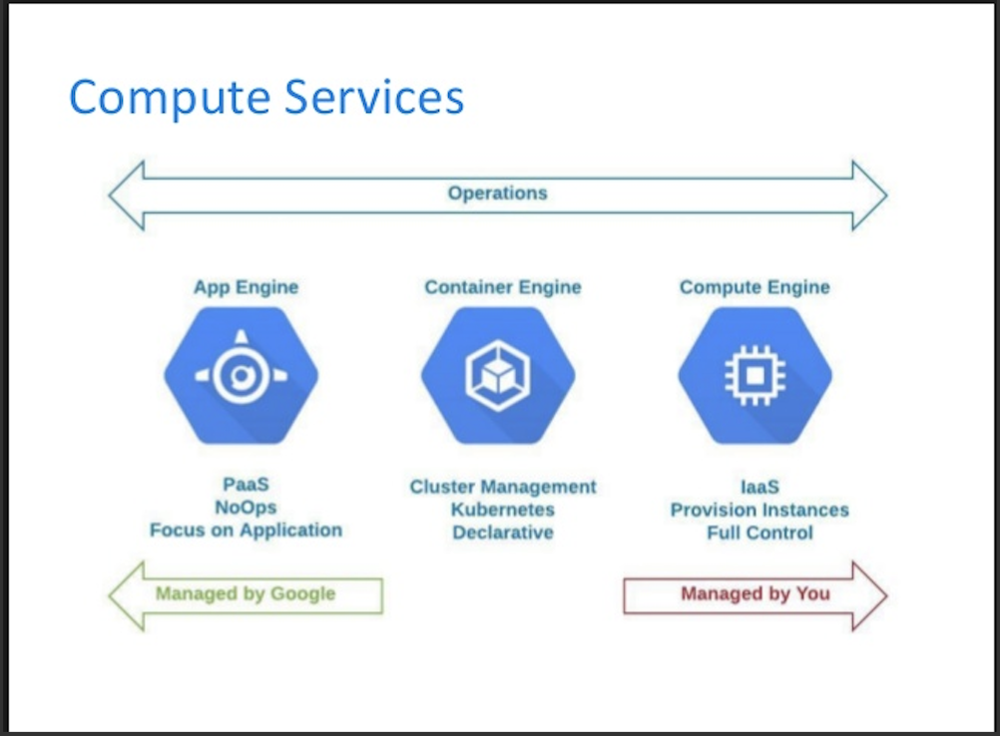

 ### 2.1 Google Compute Engine (GCE)</h3>
  
The google cloud compute is an infrastucture as a service offering that provides the power of creating virtual machines and the ability to alocate attributes such as memory, CPU, type of storage, and size of storage as well. It can be compared to building a whole computer with the ability to customizing the features according to your requirements and workloads. This can also be looked as a supplement or even a replacement for traditional on premise IT assets such as servers and routers.

 

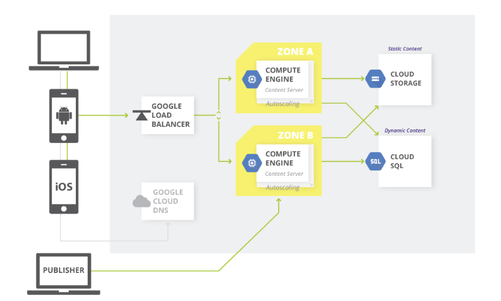

###  2.2 Google Kubernetes Engine (GKE)</h3>

Kubernetes is a container as a service that is basically an abstraction of the compute engine. It enables customers to run fully managed Docker containers. A container is a service that helps modularize applications. Why containers? Contrary to virtualization with regard to irtual machines, containers virtualize at the level of teh operating system and run the on the operating system directly. They are quite light weight, start fater than conventional VMs and use very small portion of the memory of the operating system. They also allow faster development and reliability. Kubernetes helps with the automation, monitoring, management and the deployment of these containers. 
 

### 2.3  Google App Engine (GAE) </h3>
  
Google App Engine is googles dedicated platform as a service(Paas), and is pretty much based on a "bring your code and we'll take care of the rest kind of model. This provides customers with ability to focus on development and not the infrastucture behind the development platform. The customers do have have to deal with underlying requirements of the hardware. In other words, the plaftform is ready to go. It automatically handles scaling to ensure the demands of the customer are met. The app engine can use kubernetes in the background for this cases but the user does not handly what goes on with it. It is therefore ideal for developers that does not need to deal with the idea of server configurations such as load balancing. It it mostly used for web applications.
 

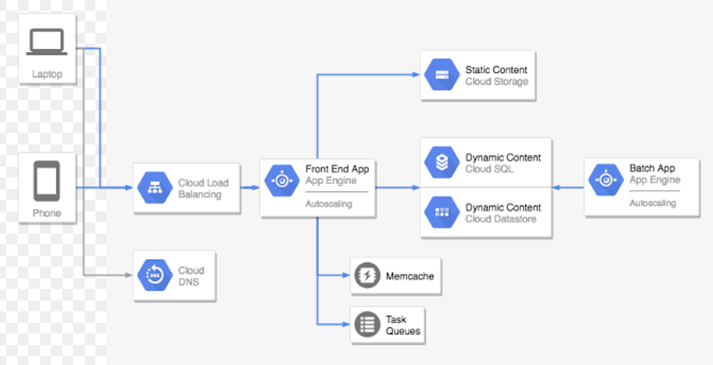

## 3. Working With Compute Services</h2>
This section will delve into how the setup and configure each of the above compute services in the google could. Google provides two options on how to perform configurations on these services. One has the option of using the user interface or google's commandline terminal, also know as gcloud. These tutorials will mainly focus on using googles interactive terminal. 

### 3.1 Google Compute</h3>

As  mentiooned, google compute engine is the core of GCP and allows creating virtual machines with the right size for a system. In this section we will expolore how to: 

* Create a virtual machine and adapt it to a project.
* Utilize commandline tools (glcoud) and use them to manage the virtual machine. 
* Install Conda, a package management system including python. 

#### 3.1.1 Getting Started

To get started, on requires to have an account with google. A gmail account would suffice. Once a account is created, login into https://cloud.google.com. This will open up a landing page that looks like the image below. On the page select  > <em>Go To Console </em>. 

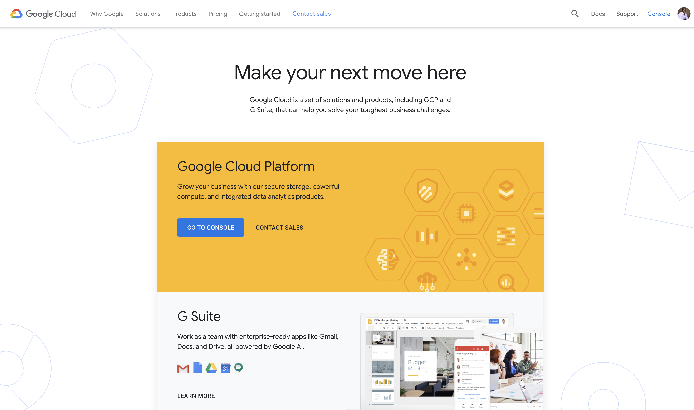

To go to the consoles dashboard, a project is required. This can be created by simply clicking the > <em>Create</em> button. For this tutorial, the commandline will be used. The top right corner has a button > <em>Activate Cloud Shell</em>. Clicking it will open up there terminal at the bottom of the page. 
 

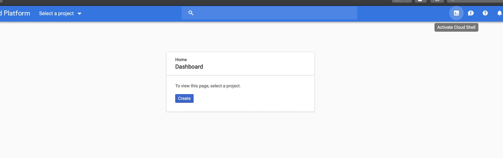

In the terminal, type the following commands to get started with project. 

* To list active active accounts and set accounts

>> $ gcloud auth list

>> $ gcloud config set account `ACCOUNT`

* To list projects
  
>> $ gcloud projects list

* To create a project, type the commmand below. We will create a project called <em>data-project-compute</em>. The output of the terminal is as seen in the image below. The project will then be created and will appear in the projects option in the UI's console. Selecting the project in the console with bring up the dashboard which displays information such as project information, resources available to the project, sample tutorials and monitoring services.
  
>>  $ gcloud projects create < data-project-compute >

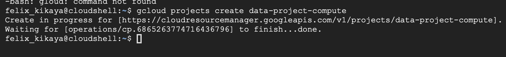

* Set the project with the following command. This will set data-project-compute as our working project.
  
 >>  $ gcloud config set project < data-project-compute >

 

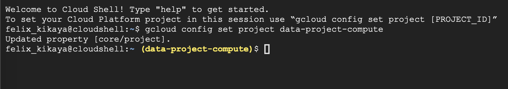

#### 3.1.2 Setting up the VM
A project in GCP helps organize resources within the service. It can consists of users, billing, authentication and settings for monitoring them. We will now create a virtual machine within this project, and configure it. 
* First, lets check available zones specify the region and zone parameters so that it is constant and avoid specifying it every time.

>> $ gcloud compute zones list

>> $ gcloud config set compute/zone us-east1-b

* The command below will create a virtual machine with a default image, which is Debian n1-standard-2, which is 2 vCPUs. The name of the instance will be data-science-vm and will set the boot disk to 100GB. Once created, the vm will be listed under Navigation Menu > Compute Engine > VM instances

>> $ gcloud compute instances create data-science-vm --machine-type n1-standard-2 --boot-disk-size=100

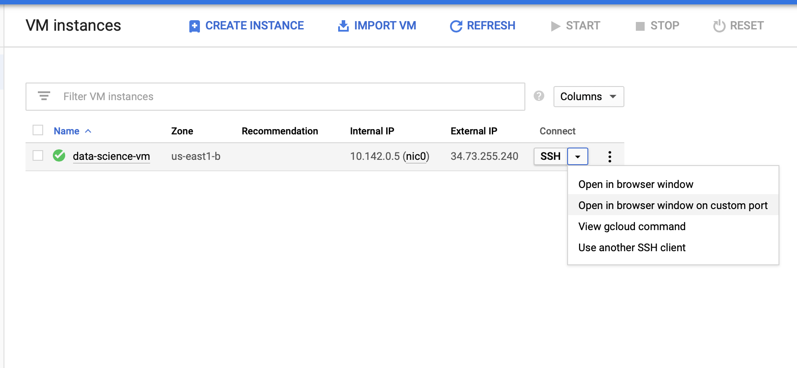

#### 3.1.3 Installing Anaconda and Python
When the virtual machine is created, it needs to be exposed to the internet inorder to download packages. In the console click on the virtual machine and ensure http and https are seleted in the options. Also, it is important to ensure that the IP address of the machine is set to "static" and not "ephemeral." The will stop the ip from changing whenever the machine is restarted.  In the Navigation Menu, this can be set by selecting >VPC Network under Networking and then selecting > External Ip Addresses. Change the type from Ephemeral to static as shown.

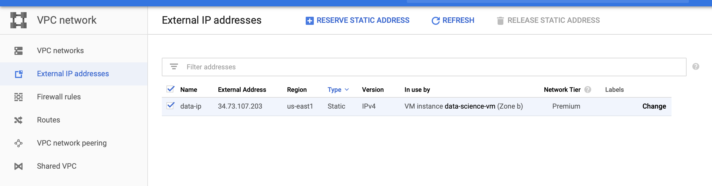

Firewall settings need to be configured as well. On the same menu select Firewall rules and change the setting to match the image below. 

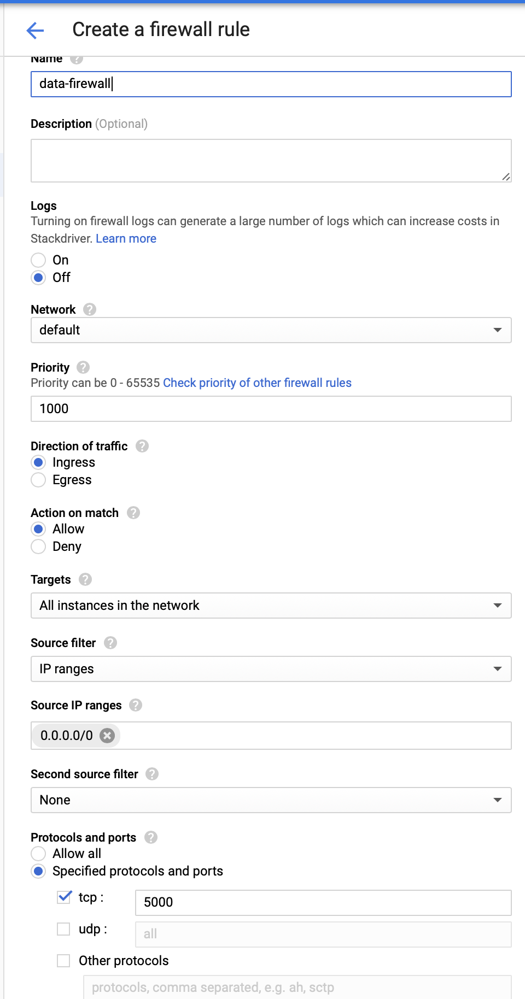

* To install Anaconda enter the commands below. These will extract the installation script from the internet and install Anaconda with its dependencies.

>>$ https://repo.continuumio/archive/Anaconda3-2018.12-Linux-x86_64.sh

>>$ Anaconda3-2018.12-Linux-x86_64.sh

>> source .bashrc

* When installation is complete the conda or pip can be used to install libraries. Next, check if the jupyter notebook configuration exists. 

>> ls ~/.jupyter/jupyter_notebook_config.py

* If not found, create the file.

>> jupyter notebook --generate-config

* This file needs to be configured for the project. Using an appropriate editor such as vim or emacs, insert the following code into the file.  Replace the port number section with the appropriate number and the ip with zeros as shown.

>> $ vim ~/.jupyter/jupyter_notebook_config.py

>>c = get_config()
c.NotebookApp.ip = '0.0.0.0'
c.NotebookApp.open_browser = False
c.NotebookApp.port = 8123

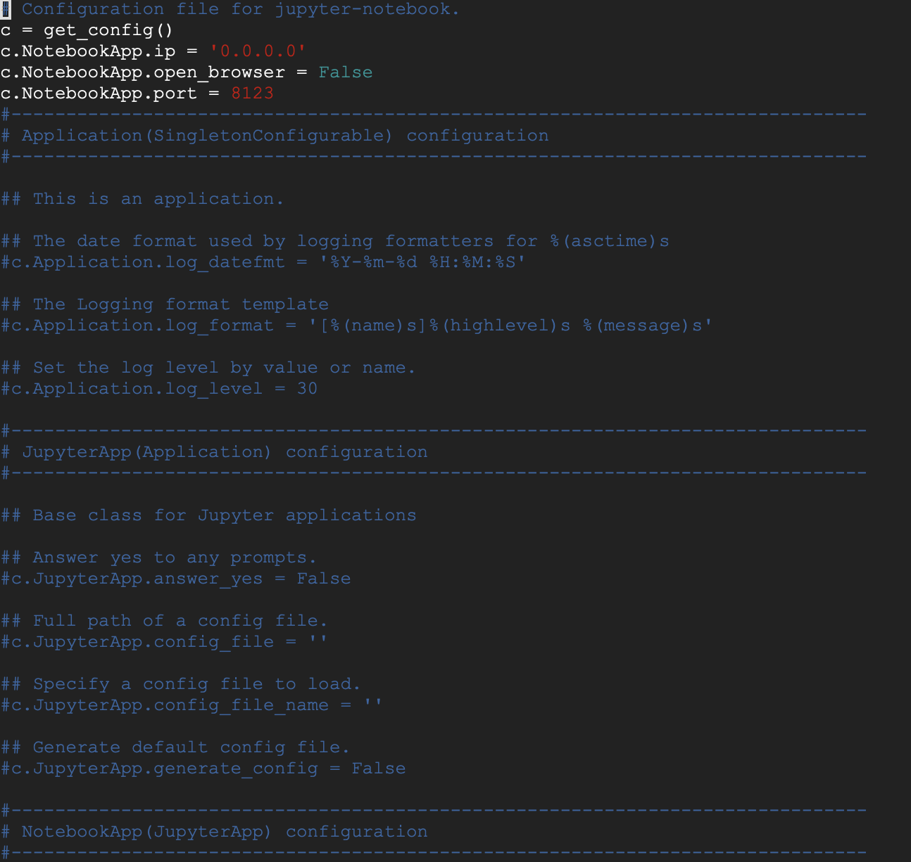

#### 3.1.4 Launch Jupyter

>> $ jupyter-notebook --no-browser --port="Port Number"

This should bring up the screen as below, this means the setup was a success.

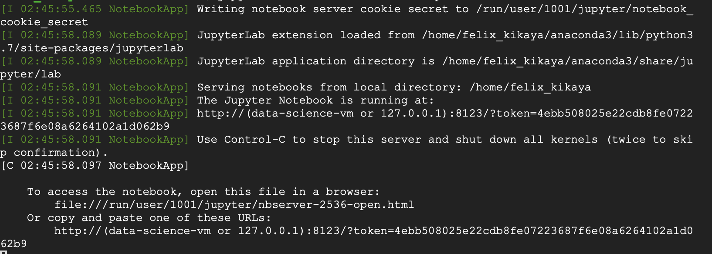

Now the server is running. To launch it in the web browser, use the static ip with the appropriate port number as shown.

> $ http://"External Static IP Address":"Port Number"
> 
